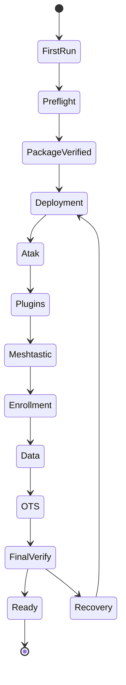

# Deployment Engine 2.4

## State machine

## Rules

- explicit Deployment Policy wins over inference
- optional failures must not become required failures
- required failures block READY
- UNKNOWN is distinct from NOT READY
- Recovery resumes from verified state
- every completed stage remains auditable
