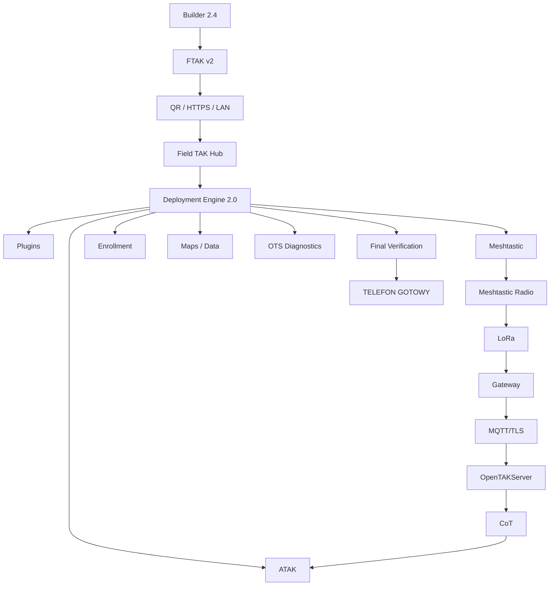
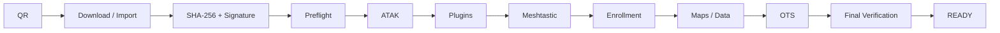
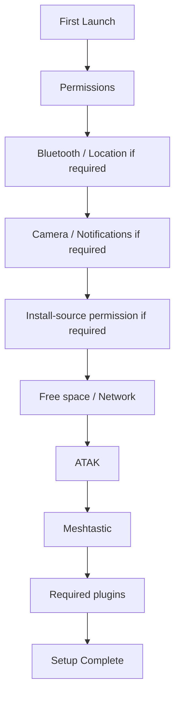
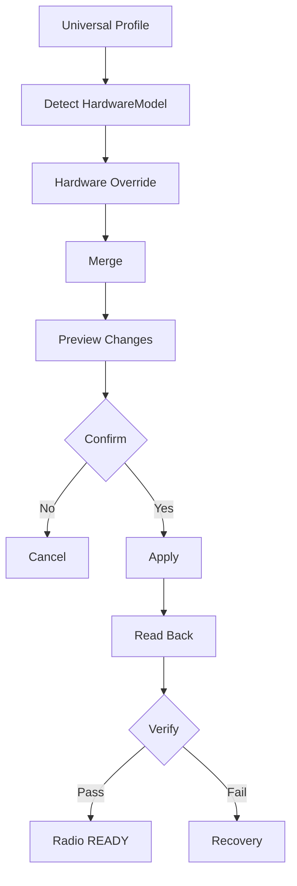

# FIELD TAK HUB 2.4 — COMPLETE SPECIFICATION

**Baseline:** 2.3.5 DEV  
**FTAK:** Schema v2  
**Deployment Engine:** 2.0  
**Status:** architecture / implementation contract

## 1. Mission

Field TAK Hub coordinates preparation of an Android device for ATAK-based events. The organizer defines the desired state; the Hub executes only what the deployment contract declares and verifies what can actually be verified.

> SKANUJESZ → KONFIGURUJESZ → SPRAWDZASZ → JESTEŚ GOTOWY

## 2. System architecture



## 3. Current vs 2.4

### Current 2.3.5 baseline

- FTAK v2
- Deployment Policy / Deployment Engine 2.0
- Builder FTAK import and Deployment 2.0 conversion
- QR/LAN/cloud provisioning paths
- ATAK/plugin/application detection and installation flows where Android permits them
- Meshtastic profile metadata and hybrid gateway diagnostics
- OTS DNS/TCP diagnostics
- Smart Diagnosis / Recovery foundations

### Target 2.4

- First Run Setup as a complete onboarding flow
- multi-package FTAK library
- native/official Meshtastic profile application where supported
- universal profile + hardware overrides
- T-Beam / T-Beam Supreme / MeshTracker X1 handling
- read-back verification after radio configuration
- first-class ATAK configuration contract
- stronger final end-to-end verification
- unified status model

### Platform/API dependent

- direct ATAK private-state inspection
- direct ATAK private certificate-store inspection
- arbitrary silent APK installation
- unsupported radio control paths
- any configuration mechanism not exposed by official/supported APIs

## 4. FTAK principle

FTAK is a declarative deployment package. It describes the desired state and the resources required to reach it.

```text
CURRENT DEVICE STATE
        |
        v
DESIRED FTAK STATE
        |
        v
DEPLOYMENT ENGINE
        |
        v
VERIFY
```

FTAK schema remains **v2**. New 2.4 fields must be backward-compatible or explicitly versioned inside existing v2 structures.

## 5. Deployment Policy

```json
{
  "deployment": {
    "atakRequired": true,
    "pluginsRequired": true,
    "serverRequired": true,
    "meshtasticRequired": false,
    "enrollmentRequired": false,
    "missionPackageRequired": false,
    "mapsRequired": false,
    "overlaysRequired": false
  }
}
```

The engine must not infer required components when an explicit policy is present.

## 6. Main deployment workflow



## 7. Recovery

Recovery is reconciliation, not a blind restart:

```text
read current state
  -> preserve READY steps
  -> retry failed step
  -> continue remaining plan
  -> verify again
```

## 8. Final verification

A required component may only be marked `READY` after a real check appropriate to that component. If a component cannot be inspected, use `UNKNOWN`; if it is outside the selected deployment topology, use `NOT APPLICABLE`.

## 9. Status model

```text
READY
NOT READY
WARNING
UNKNOWN
NOT APPLICABLE
OPTIONAL
REQUIRED
```

`UNKNOWN` is not an error by itself.

## 10. First Run Setup



Only permissions actually required by the current workflow should be requested.

## 11. FTAK Package Library

Required 2.4 capabilities:

- multiple packages
- import
- scan new QR
- active package
- package metadata
- SHA-256 verification
- signature verification
- delete
- redeploy
- content preview

## 12. ATAK configuration

Builder 2.4 should model supported ATAK deployment inputs such as:

- server configuration
- position/reporting policy where supported
- location/GPS requirements
- required plugins
- maps and mission packages
- event-specific resources

The Hub must never claim access to private ATAK state unless an official/supported mechanism actually provides it.

## 13. Meshtastic Profile Manager



Target hardware profiles:

- T-Beam
- T-Beam Supreme
- SenseCAP MeshTracker X1

Hardware must be identified from the actual device model when the communication mechanism exposes it; user-entered labels are not sufficient evidence.

## 14. Meshtastic security

Universal profiles default to:

```json
{
  "security": {
    "copyDeviceIdentity": false,
    "copyPrivateKeys": false
  }
}
```

Do not place MQTT passwords, private keys, private certificates or long-lived production secrets in a public `.ftak` package.

## 15. Gateway topology

Current documented infrastructure pattern:

```text
FIELD NODE
   |
   | LoRa
   v
Heltec WiFi LoRa 32 V3
   |
   | MQTT/TLS :8883
   v
OpenTAKServer
   |
   | CoT :8089
   v
ATAK
```

For a normal field node, gateway and gateway MQTT ownership can be `NOT APPLICABLE`. TCP reachability of the MQTT endpoint does not prove physical LoRa/gateway connectivity.

## 16. OTS diagnostics

Minimum checks:

```text
DNS
HTTPS 8443
API / Enrollment 8446
CoT 8089
MQTT/TLS endpoint when topology requires it
```

A successful network check is not equivalent to ATAK authentication or end-to-end radio verification.

## 17. End-to-end verification

```text
DEVICE
 -> ATAK
 -> PLUGIN
 -> MESHTASTIC
 -> RADIO
 -> LoRa
 -> GATEWAY
 -> MQTT/TLS
 -> OPENTAKSERVER
 -> CoT
 -> ATAK
```

The verification UI should show which link was actually tested and which links remain unverified.

## 18. Simple mode

The participant flow should be:

```text
SCAN QR
 -> VERIFY
 -> DEPLOY
 -> CONFIRM REQUIRED ACTIONS
 -> FINAL VERIFY
 -> READY
```

Technical details belong in Advanced / Diagnostics mode.

## 19. Advanced mode

Expose:

- deployment plan
- diagnostics
- logs
- recovery
- ATAK status
- plugin status
- Meshtastic/radio status
- OTS status
- package library
- verification details

## 20. Error handling

Every user-facing deployment error should contain:

```text
CODE
TITLE
DESCRIPTION
CAUSE
ACTION
RECOVERY
```

Avoid exposing raw exceptions in Simple mode.

## 21. Logging

Events should contain:

```text
Timestamp
Component
Level
Event
Result
Error Code
```

Secrets must never be written to logs.

## 22. Compatibility

2.4 must retain FTAK schema v2 compatibility and preserve existing package content when importing/editing older v2 packages.

## 23. Definition of Done

- Builder 2.4 contract implemented
- FTAK v2 compatibility preserved
- Deployment Policy validated
- QR verified before deployment
- FTAK library supports multiple packages
- First Run Setup complete
- ATAK/plugin workflow verified
- Meshtastic profile manager implemented through supported APIs
- hardware detection and overrides verified
- radio write + read-back verified
- enrollment verified where applicable
- OTS diagnostics verified
- Recovery verified
- Final Verification distinguishes UNKNOWN from failure
- security gates pass
- automated source tests pass
- platform builds pass in CI before release

## 24. Implementation rule

Never implement a fake `READY` state. A status must be backed by a real observation, a supported API result, or an explicit topology rule such as `NOT APPLICABLE`.
